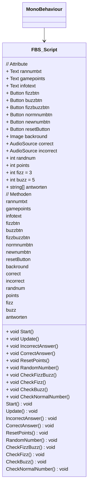

# FizzBuzz Spiel

## Spielbeschreibung

Das Spiel „FizzBuzz“ stellt dem Spieler eine Zahl zwischen 1 und 999 vor. Die Aufgabe des Spielers besteht darin, zu entscheiden, ob die präsentierte Zahl durch 3 (Fizz), durch 5 (Buzz) oder durch 3 und 5 (FizzBuzz) teilbar ist. Für jede richtige Antwort erhält der Spieler Punkte. Bei falscher Antwort gibt es keine Punkte.  
Falls die Zahl weder durch 3, noch durch 5 oder durch beide teilbar ist, muss der Spieler die Zahl als normale Nummer angeben.  
Das Ziel ist, so viele Punkte wie möglich zu sammeln, indem man die Teilbarkeit der Zahlen richtig erkennt.

## Spielanleitung

1. Generiere eine neue Zahl mit der „space“-Taste oder mit dem Button „New Number“.
2. Entscheide, ob die Zahl durch 3, durch 5 oder durch 3 und 5 teilbar ist.
3. Gib das Ergebnis mit den Buttons „Fizz“ (durch 3), „Buzz“ (durch 5) oder „FizzBuzz“ (durch 3 und 5) an.
4. Falls die Zahl weder durch 3 noch durch 5 teilbar ist, gib die Zahl als normale Nummer an.
5. Um die im Spiel erlangten Punkte zurückzusetzen, betätige den Button „Reset Points“.

### So funktioniert das Spiel im Überblick:
1. Eine Zahl zwischen 1 und 999 wird präsentiert.
2. Der Spieler entscheidet, ob die Zahl:
    - durch 3 (Fizz),
    - durch 5 (Buzz) oder
    - durch 3 und 5 (FizzBuzz) teilbar ist.
3. Ist die Antwort korrekt, gibt es Punkte.
4. Ist die Zahl durch keine dieser Zahlen teilbar, gibt der Spieler sie als normale Nummer an.
5. Falsche Antworten bringen keine Punkte.

Viel Spaß beim Spielen und Punkte sammeln!

### Testergebnisse der Fizz-Buzz-App

#### Allgemeine Informationen:
- Alter des Testers: 16 (Thabo), 52 (Papa), 49 (Mama)
- Testerfahrung:
  - Thabo: Experte
  - Papa: Anfänger
  - Mama: Anfänger

#### Benutzerfreundlichkeit:
**Wie intuitiv fanden Sie die Benutzeroberfläche der App?**
- Thabo: Mittel
- Papa: Intuitiv
- Mama: Sehr intuitiv

**Wie gut waren die Anweisungen und Hinweise im Spiel?**
- Thabo: Sehr hilfreich
- Papa: Hilfreich
- Mama: Mittel

#### Spielerlebnis:
**Wie unterhaltsam fanden Sie das Spiel insgesamt?**
- Thabo: Unterhaltsam
- Papa: Sehr unterhaltsam
- Mama: Unterhaltsam

**Wie herausfordernd fanden Sie das Spiel?**
- Thabo: Mittel
- Papa: Mittel
- Mama: Mittel

**Wie motiviert waren Sie, das Spiel immer wieder zu spielen?**
- Thabo: Motiviert
- Papa: Sehr motiviert
- Mama: Motiviert

#### Fehlerbehandlung und Feedback:
**Haben Sie während des Spielens Fehler oder Abstürze erlebt?**
- Thabo: Nein
- Papa: Nein
- Mama: Nein

**Wie hilfreich waren die Fehlermeldungen?**
- Thabo: Hilfreich
- Papa: Mittel
- Mama: Mittel

**Wie schnell konnte sich das Spiel von einem Fehler erholen?**
- Thabo: -
- Papa: -
- Mama: -

**Wie klar und verständlich war das Feedback, das Sie im Spiel erhalten haben (z.B. visuell, auditiv)?**
- Thabo: Klar
- Papa: Klar
- Mama: Klar

#### Verbesserungen und Vorschläge:
**Welche Funktionen oder Elemente haben Ihnen besonders gut gefallen?**
- Thabo: Die visuelle Darstellung der Punktzahl.
- Papa: Die klaren Anweisungen und die farbliche Rückmeldung.
- Mama: Die unterschiedlichen Soundeffekte für richtige und falsche Antworten.

**Welche Funktionen oder Elemente haben Ihnen nicht gefallen oder haben gefehlt?**
- Thabo: Es fehlte eine Option, den Schwierigkeitsgrad anzupassen.
- Papa: -
- Mama: Die Schriftgröße der Anweisungen war zu klein.

**Haben Sie Vorschläge zur Verbesserung der App?**
- Thabo: Ein fortgeschrittener Modus für erfahrene Spieler wäre gut.
- Papa: Eine detailliertere Anleitung für Anfänger wäre hilfreich.
- Mama: Größere Schrift und mehr Kontraste für bessere Lesbarkeit.

**Gibt es sonst noch etwas, das Sie über Ihre Erfahrung mit der Fizz-Buzz-App mitteilen möchten?**
- Thabo: Insgesamt eine solide App.
- Papa: Ich hatte viel Spaß und würde es wieder spielen.
- Mama: Eine gute App, besonders geeignet für kurze Spielsessions zwischendurch.

### Fehlerprotokoll für FBS_Script.cs

Das folgende Fehlerprotokoll dokumentiert mögliche Fehler, die während der Ausführung des FBS_Scripts auftreten können. Es enthält die Beschreibung des Fehlers, die Bedingungen, unter denen der Fehler auftritt, und mögliche Lösungsvorschläge.

#### Fehlerprotokoll

1. **Fehler**: `NullReferenceException`
   - **Beschreibung**: Ein `NullReferenceException` tritt auf, wenn auf eine nicht zugewiesene Instanz einer Klasse zugegriffen wird.
   - **Bedingung**: Dieser Fehler kann auftreten, wenn eine der öffentlichen Variablen (`Text rannumtxt, gamepoints, infotext`, `Button fizzbtn, buzzbtn, fizzbuzzbtn, normnumbtn, newnumbtn, resetButton`, `Image backround`, `AudioSource correct, incorrect`) nicht im Unity-Editor zugewiesen wurde.
   - **Lösung**: Überprüfen Sie, ob alle öffentlichen Variablen im Inspector zugewiesen wurden.

2. **Fehler**: `IndexOutOfRangeException`
   - **Beschreibung**: Ein `IndexOutOfRangeException` tritt auf, wenn auf ein Array-Element außerhalb des gültigen Bereichs zugegriffen wird.
   - **Bedingung**: Dieser Fehler kann auftreten, wenn das `antworten`-Array nicht ordnungsgemäß initialisiert wird.
   - **Lösung**: Stellen Sie sicher, dass das `antworten`-Array in der `Start`-Methode korrekt initialisiert wurde und dass der Zugriff auf das Array innerhalb des gültigen Bereichs erfolgt.

3. **Fehler**: `InvalidOperationException`
   - **Beschreibung**: Ein `InvalidOperationException` tritt auf, wenn eine ungültige Operation für den aktuellen Zustand eines Objekts durchgeführt wird.
   - **Bedingung**: Dieser Fehler kann auftreten, wenn versucht wird, auf Audioquellen (`correct`, `incorrect`) zuzugreifen, die nicht initialisiert oder zugewiesen wurden.
   - **Lösung**: Stellen Sie sicher, dass die Audioquellen im Inspector zugewiesen wurden und vor dem Zugriff initialisiert sind.
